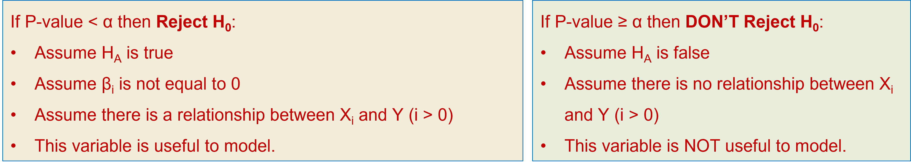

```{r setup, include=FALSE, echo=FALSE}
options(htmltools.dir.version = FALSE)
knitr::opts_chunk$set(
  fig.retina=2,
  #out.width = "75%",
  #out.height = "50%",
  htmltools.preserve.raw = FALSE,      # needed for windows
  scipen=100,                          # suppresses scientific notation
  getSymbols.warning4.0 = FALSE,       # suppresses getSymbols warnings
  cache = FALSE,
  echo = TRUE,
  hiline = TRUE,
  message = FALSE, 
  warning = FALSE
)


# install helper package (pacman)
# pacman loads and installs other packages, if needed
if (!require("pacman")) install.packages("pacman", repos = "http://lib.stat.cmu.edu/R/CRAN/")

# install and load required packages
# pacman should be first package in parentheses and then list others
pacman::p_load(pacman, tidyverse, gridExtra, magrittr, tools)

# verify packages (comment out in finished documents)
p_loaded()


```

```{r xaringan-themer, include=FALSE, warning=FALSE}
library(xaringanthemer)

palette <- c(
  SU_Orange1        = "#F76900",
  SU_Orange2        = "#FF8E00",
  SU_Red_Orange     = "#FF431B",
  SU_Blue1          = "#000E54",
  SU_Blue2          = "#203299",
  SU_Light_Blue     = "#2B72D7",
  SU_White          = "#FFFFFF",
  SU_Light_Gray     = "#ADB3B8",
  SU_Medium_Gray    = "#707780",
  SU_Black          = "#000000", 
  
  steel_blue        = "#4682B4",
  corn_flower_blue  = "#6495ED",
  deep_sky_blue     = "#00BFFF",
  dark_magenta      = "#8B008B",
  medium_orchid     = "#BA55D3",
  lime_green        = "#32CD32",
  light_sea_green   = "#20B2AA",
  chartreuse        = "#7FFF00",
  orange_red        = "#FF4500",
  white_smoke       = "#F5F5F5",
  dark_cyan         = "#008B8B",
  light_steel_blue  = "#B0C4DE",
  indigo            = "#4B0082",
  ivory             = "#FFFFF0",
  light_slate_grey  = "#778899",
  linen             = "#FAF0E6",
  steel_blue        = "#4682B4",
  blue_violet       = "#8A2BE2",
  dodger_blue       = "#1E90FF",
  light_blue        = "#ADD8E6",
  azure             = "#F0FFFF",
  lavender          = "#E6E6FA")

primary_color = "#4682B4"                # steel_blue
secondary_color = "#778899"              # light_slate_grey
white_color = "#FFFFF0"                  # ivory
black_color = "#000080"                  # navy

style_duo_accent(
  primary_color = primary_color,
  secondary_color = secondary_color,
  white_color = white_color,
  black_color = black_color,
  text_color = black_color,
  header_color = primary_color,
  background_color = white_color,
  code_inline_background_color = "#E6E6FA", # lavender
  link_color = "#1E90FF",                   # dodger_blue
  code_inline_color = "#4B0082",            # indigo
  text_bold_color = "#8B008B",              # dark_magenta
  header_font_google = google_font("Open Sans"),
  text_font_google = google_font("Open Sans"),
  code_font_google = google_font("Source Code Pro"),
  colors = palette
)


```

```{r xaringan-panelset, echo=FALSE}
xaringanExtra::use_panelset()
```

```{r xaringan-tile-view, echo=FALSE}
xaringanExtra::use_tile_view()
```

```{r xaringan-fit-screen, echo=FALSE}
xaringanExtra::use_fit_screen()
```

```{r xaringan-tachyons, echo=FALSE}
xaringanExtra::use_tachyons()
```

```{r xaringan-animate-css, echo=FALSE}
xaringanExtra::use_animate_css()
```

```{r xaringan-animate-all, echo=FALSE}
#xaringanExtra::use_animate_all("slide_up")
```

background-image: url("docs_files/images/sloth_faded.png")
background-size: cover

class: bottom, right

## BUA 345 - Lecture 10

### Intro to Correlation, SLR, and MLR in R

<br>


#### Penelope Pooler Eisenbies

#### `r Sys.Date()`

[Wikipedia Sloth Page](https://en.wikipedia.org/wiki/Sloth)

---

### Getting Started with Markdown

- Download Zipped R project 

- Open Zipped folder and copy internal folder (R Project) to a BUA 345 folder on your computer NOT IN DOWLOADS

- Click on .Rproj file to open project

- Click on `code_data_output` file to open it.

- Click on `BUA_345_Lecture_10.Rmd` to open it.

- Run Setup Chunk

### Setup

* The setup chunk shows the packages needed for this demo.   

* R will install specified packages if needed (only required once after R is installed)  

* R will load specified packaged (required every time you start a new R session)  

* The first time you run this code, R will install these packages which will be slow.  

* **If you get warnings, that's okay.**  

* If you get **error messages**, I (or TA), can help you.

---

### Setup Chunk for Lecture 10

```{r setup for Lecture 10, include = T}


# this line specifies options for default options for all R Chunks
knitr::opts_chunk$set(echo=T, highlight=T)

# suppress scientific notation
options(scipen=100)

# install helper package that loads and installs other packages, if needed
if (!require("pacman")) install.packages("pacman", repos = "http://lib.stat.cmu.edu/R/CRAN/")

# install and load required packages
pacman::p_load(pacman,tidyverse, magrittr, olsrr)

# verify packages
p_loaded()

```
<br>

**NOTE:** Don't worry about `xaringanthemer` package.  That is required for my slides but not for your code.


---

### Lecture 10 In-class Exercises

#### **Question 1 (L10) - Session ID: bua345s23**

Recall the housing price data from Lecture 9: The hypothesized full model is: 


where each coefficient in the output is an estimate of a beta from the model and each row shows a one sample two-tailed hypothesis test.


---

.pull-left[

### Lecture 10 In-class Exercises

#### **Question 1 Continued (L10) - Session ID: bua345s23**

**We typically use **α = 0.05** as a cutoff in regression.
If we had set **α = 0.01**, which variable would not be considered ‘useful’ to the model?**

A. Living Area  
  
B. Bathrooms  
  
C. House Age
]

.pull-right[

```{r echo=F}


```

]




---

### Plan for Today - Getting Started With R and RStudio

#### Why go beyond Excel?

- Summary statistics, Correlation, SLR, and MLR (sort of) can all be done in Excel.

 - MLR is less efficient and very limited.

- Visualizing data and addressing issues (outliers, curvilinear pattern, etc.) are doable but less efficient.

- In Lecture 12, we will cover categorical variables which Excel can not handle effectively

- Documenting your work is essential in analytical work and is not easily done in Excel.

---
  
### Pros and Cons of R and RStudio

#### Pros:

- Analytical flexibility is almost unlimited

- Writing scripts provides a record (documentation) of work
 
- Large repetitive projects can be done as batches once you learn coding (advanced skill)
 
- Software (R) and user interface (R Studio) are FREE!!!! 
  
- Visualizations – many high quality flexible options

#### Cons:

- Learning curve is a little steep

- Requires patience and trial and error

---

### Opening R and RStudio

- Default RStudio Screen has Four Panes:

<center>

```{r echo=F}


```


</center>
---

### Opening R and RStudio

Note: You may only see three panes if no R Markdown or R Scripts are open.

- Upper Left Pane: Source Code
  - R Markdown files and R scripts

- Lower Left Pane: Console
    - R input code and output is shown here (and in Markdown file)

- Upper Right Pane: Global Environment
    - R objects like datasets, plots, values, etc. are stored and listed here
    
- Lower Right Pane: Files, Plots, Packages, Help, etc.
  
  - Files: Files in R project can be viewed and opened here
    
  - Plots: Plots appear here when NOT using R Markdown
    
  - Packages: R package library searchable here
    
  - Help: Type ?____ fill in the blank with R command or R object to bring up help file.

---

### What version do you have?

#### R version 

- R version appears in console when you open R and RStudio.

- Also appears in bar above console  

- Alternatively type `version$version.string` in console

```{r r version,}
version$version.string
```

#### RStudio Version 

- In Windows OS, RStudio version appears when you click **Help > About RStudio**
    
- In Mac OS, RStudio version appears when you click **RStudio > About RStudio** 

- Alternatively, type `RStudio.Version()$version` in the console


---

### Opening a Project

**`1.`** Download zipped R project, unzip it and save to your BUA 345 folder on your computer.

<br>

**`2.`** Easiest way to start: 

- Close RStudio before opening a project.

<br>

**`3.`** With RStudio closed, open the R Project Directory folder and click on `.Rproj` file.
 
- **Clicking on `.Rproj` file will open RStudio and R AND open the project at the same time.**

---

### Using R as a Calculator

- The console in R can be used as a calculator


### Running code from a Markdown File

#### To run ONLY ONE line of R code:

- Place cursor anywhere line with code and click:

  - Ctrl + Enter (Windows)

  - Cmd + Return (Mac)

- Run button at top of Upper-Right Pane    

#### To run a whole chunk (multiple R commands):

- Click green triangle in upper right of chunk   

  - Ctrl + Shift + Enter (Windows)

  - Cmd + Shift + Return (Mac)

---

### Lecture 10 In-class Exercises

#### **Question 2 (L10) - Session ID: bua345s23**
  
Below is small R Chunk with a calculation.
 - `#` before text indicates a comment. R will ignore this text.
 
```{r first calculations in R, eval=F}
(10*3) + sqrt(987) - (2*4) + 4567               # unrounded calculation
((10*3) + sqrt(987) - (2*4) + 4567) |> round(2) # rounded to 2 decimal places

```

Experiment with running the lines one at a time and running th whole chunk.

The output should appear below the chunk and in the Console (Lower Left Pane)  

**What is the value from these calculations, rounded to 2 decimal places?**

A. 4620.12
  
B. 4680.42
  
C. 4660.32
  
D. 4620.42

---

### Lecture 10 In-class Exercises

#### **Question 3 (L10) - Session ID: bua345s23** 

#### Creating and Saving Objects in R - Entering small datasets manually 

**`1.`** Copy and paste the R code shown below into the provided R Chunk.

```{r eval=F}
ages <- c(21,18,27,43,56,23,23,25,29,40)   # create ages data vector
median(ages)                               # calculate median of ages
summary(ages)                              # calculate summary statistics for ages data

```


**`2.`** Run this code to create a numerical variable named `ages`.

**`3.`** Notice that `ages` appears in the `Global Environment`.

**`4.`** Find the median of `ages` using the `median` command.

**The median of the `ages` data is:**
  
A. 24  
B. 25  
C. 26  
D. 27  
E. 28  

---


.pull-left[

#### Types of Data in R

- **Character:** *`<chr>`* or string values
  
  - These values appear as text in quotes
  
  - e.g. names, eye-color, days of the week, etc.
  
<br>
  
- **Double:** *`<dbl>`* or decimal numeric values

<br>

- **Integer:** *`<int>`* integer numeric values

<br>

- **Logical:** *`<lgl>`* `TRUE`/ `FALSE` or `T`/`F`, MUST be UPPERCASE

<br>
  
- **Factor:** *`<fct>`* Categorical variables can be created from other data types above.

]

.pull-right[

#### Objects in R

- **Datasets, values, arrays (vectors)**, can all be saved as objects.  
  
   - No quotes are used in object names
   
   - Saved objects appear in the Global Environment 
   
   - Helpful to make object names be one lower case word with no spaces
      - Use underscores in place of spaces, if needed
      
   - Any calculation you do can also be stored as an object.


]


---

### Importing Data into R

- In BUA 345, all data files will be stored in R Project `code_data_output` folder with R Markdown file

- `tidyverse` package must be loaded in `setup` chunk above

- running this code will save `houses` dataset to the `Global Environment`.

- `#` before text indicates a comment. R will ignore this text.**

```{r import houses data}
houses <- read_csv("houses.csv")                     # import houses data
houses <- read_csv("houses.csv", show_col_types = F) # same command with message surpressed

# same command with glimpse afterwards to examine data
# pipe |> operator used to make code more efficient

houses <- read_csv("houses.csv", show_col_types = F) |> glimpse()                                                               
```

---

### Examining Data - Variable Summaries and Correlations in R
  

```{r variable summaries and correlations in R}

houses |> select(Living_Area) |> summary() # summary of living area (with piping)

summary(houses$Living_Area)                # summary of living area without piping

houses |> summary()                        # summary of houses data (with piping)                                   
```

---

### Examining Data - Variable Summaries and Correlations in R
  
```{r summary without pipe, eval=F}
summary(houses)                            # summary without piping
```

```{r correlations in r with and without pipe}

houses |> cor()                            # correlation matrix for houses (with piping)

cor(houses)                                # correlation matrix for houses (without piping)

```

---

.pull-left[

### Lecture 10 In-class Exercises

#### **Question 4 (L10) - Session ID: bua345s23** 

**What is the maximum selling price in the houses data?** 

**Round answer to closest thousand (K)**

A. 150 K     
B. 165 K    
C. 205 K    
D. 291 K    
E. 466 K    
F. 521 K    

]

.pull-right[


```{r R code calculate rounded max values}
# unrounded using summary()
houses |> pull(Selling_Price) |> summary() 

 # unrounded using max()
houses |> pull(Selling_Price) |> max()     

# rounded to closest thousand
# round(-3) means round to third place before decimal (thousands)
houses |> pull(Selling_Price) |> summary() |> round(-3)
houses |> pull(Selling_Price) |> max() |> round(-3)

```

]


---


### Lecture 10 In-class Exercises

#### **Question 5 (L10) - Session ID: bua345s23** 

**What is the correlation between `House_Age` and `Living_Area` in the `houses` dataset? Round answer to two decimal places.** 

A. 0.77    
B. 0.71    
C. 0.66    
D. -0.22    
E. -0.38   
F. -0.52    
    
NOTE:  All values in correlation matrix can be rounded at once with `round` command.

```{r  calculate rounded correlation matrix}

houses |> cor() |> round(2)   # rounded correlation matrix to two decimal places with piping

```

---

### Simple Linear Regression (SLR) in R

- **`olsrr`** package must be loaded in **`setup`** chunk

- **Enclose model command in parentheses so that it is BOTH saved to 'Global Environment' AND printed to screen.**

#### New Term to Know, R<sup>2</sup>

```{r echo=F, out.width=800, out.height=250}


```

---

### Review of Parameter Estimates Output

- **model** column lists intercept and X variables in model

- ***Beta*** column shows the estimate (***b***) of the Beta coefficient for each variable in model.

- **Std. Error** shows variability of each estimated ***Beta***.

- **t** = Beta/Std. Error, the test statistic for each Beta estimate

- **Sig** is P-value for Hypothesis test for each Beta estimate:

  - Recall Interpretation guidelines for P-value:

<center>


---

### R code to create and view a MLR model


```{r slr houses model, eval=F}
# slr model with just living area
(houses_slr <- ols_regress(Selling_Price ~ Living_Area, data = houses))

```

#### Abridged SLR Output:

```{r echo=F}


```

---

### Multiple Linear Regression (MLR) in R

- Extending this model to Multiple Linear Regression is straightforward.
- Additional terms are added to the model with a `+` sign between them:
- MLR model for houses data:


```{r mlr houses model, eval=F}

# mlr model with living area, bathrooms and house age in model
(houses_mlr <- ols_regress(Selling_Price ~ Living_Area + Bathrooms + House_Age, data = houses))

```

#### Abridged MLR Output:

```{r echo=F}

knitr::include_graphics("docs_files/images/mlr_out1.jpg")

knitr::include_graphics("docs_files/images/mlr_out2.jpg")

```


---

### Lecture 10 In-class Exercises

#### **Question 6 (L10) - Session ID: bua345s23**  

**Assuming number of bathrooms and age of a house are unchanged, what would be the CHANGE in price due *SOLELY to building an addition that adds 300 square feet to the living area?***   
 
**Round answer to closest thousand dollars (K)**

A. 14 K  
B. 16 K  
C. 18 K  
D. 20 K  
E. 22 K  


```{r calculating change in y, eval = F}
# two ways to save beta value

b_lvng_area <- 60.614                     # type value manually

b_lvng_area <- houses_mlr$betas[2]        # use stored betas vector (not required)

(b_lvng_area*300) |> round(-3)            # answer to question

```

---

### HW 5

- HW 5 will include an R Project with an R Markdown template 

- You will add code and run it.

- Edit text portions with your own notes 

- Add comments to R code in chunks using `#`

<br>

### Looking Ahead:
  
- Today’s methods could have been done in Excel 

- Next topics are not feasible in Excel

- On Thursday: histograms, log transformations, more MLR

- Next week: adding categorical terms and Interaction terms to model

---

background-image: url("docs_files/images/tired_panda_faded.png")
background-size: cover

.pull-left[

### **Key Points from Today**

.bg-azure.b--dark_cyan.ba.bw2.br3.shadow-5.ph2[

#### Concepts Covered:

- Using R and RStudio 
- Opening R Projects
- Running setup to install and load required R packages
- Importing and Examining Data
- Calculating data summaries and correlations
- Running SLR and MLR models and examining output

#### Additional Related Concepts:

- Document each step and add comments to script
- R Markdown is great for saving code and output in one file

]

]

.pull-right[

.bg-azure.b--dark_cyan.ba.bw2.br3.shadow-5.ph3[
You may submit an 'Engagement Question' about each lecture until midnight on the day of the lecture. **A minimum of four submissions are required during the semester.**
]

]


  


